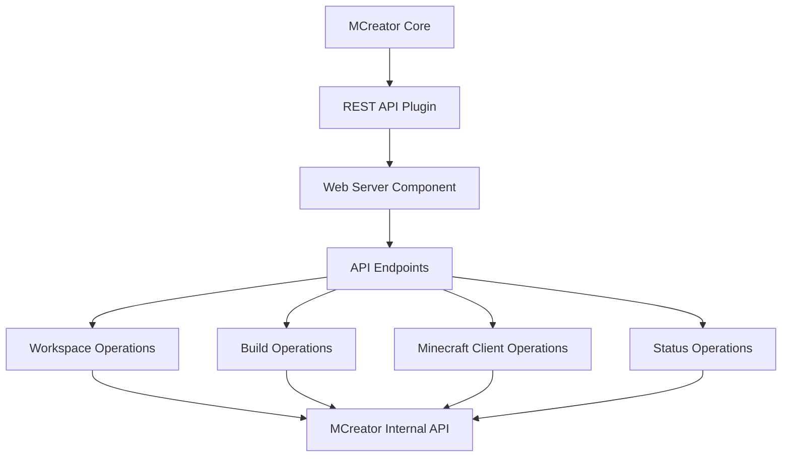
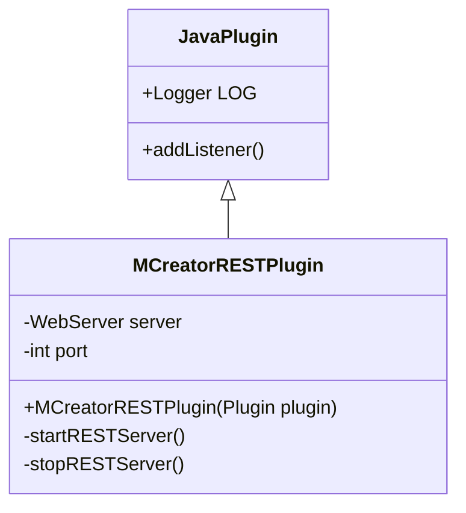
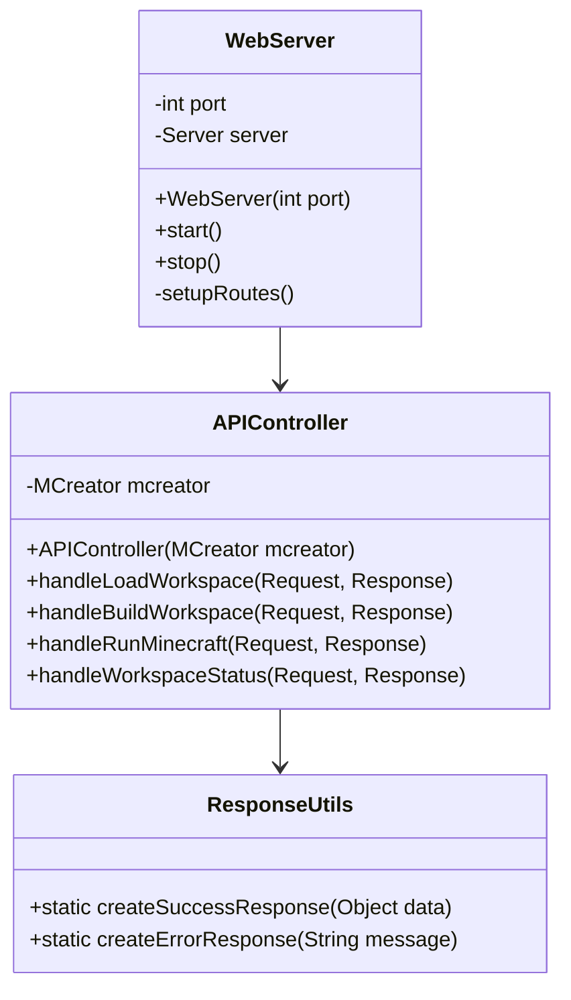

# MCreator REST API Plugin - Implementation Plan

## Overview

We'll develop a plugin that extends the existing `JavaPlugin` class and implements a REST API server to provide headless operation capabilities for MCreator. The plugin will:

1. Initialize and start a lightweight REST server when MCreator loads
2. Implement the required API endpoints using MCreator's internal methods
3. Provide proper error handling and JSON response formatting
4. Log all operations for debugging purposes

## Architecture



## Component Breakdown

### 1. Plugin Structure



### 2. REST Server Component



### 3. API Implementation

#### REST Endpoints

1. `POST /api/workspace/load`
   - Accepts JSON with workspace path
   - Validates path and loads workspace using MCreator's API
   - Returns success/error response

2. `POST /api/workspace/build`
   - Triggers build process using MCreator's internal API
   - Captures build logs
   - Returns build status, logs, and result file paths

3. `POST /api/minecraft/run`
   - Launches Minecraft client using MCreator's internal API
   - Captures runtime logs
   - Returns process status and logs

4. `GET /api/workspace/status`
   - Retrieves workspace information
   - Returns detailed workspace state

## Implementation Steps

1. **Project Setup**
   - Update build.gradle to include web server dependencies
   - Update plugin.json with correct metadata

2. **Create Core Plugin Class**
   - Implement the main plugin class that extends JavaPlugin
   - Add server initialization and shutdown logic

3. **Implement Web Server Component**
   - Create a web server class to handle HTTP requests
   - Setup route handlers for all required endpoints

4. **Implement API Controllers**
   - Create controller classes for handling API requests
   - Implement the required endpoint logic

5. **Implement Helper Utilities**
   - Create utility classes for response formatting
   - Implement error handling and logging

6. **Testing**
   - Test each endpoint individually
   - Test integration with MCreator
   - Test error handling and edge cases

## Technical Considerations

### Dependencies

We'll need to add the following dependencies to the project:
- Lightweight web server framework (like Javalin or Spark Java)
- JSON processing library (like Jackson or Gson)

### Web Server Configuration

The REST API server will:
- Run on a configurable port (default 8080)
- Support CORS for cross-origin requests if needed
- Use JSON for all request and response payloads
- Implement appropriate security measures

### API Design Principles

All endpoints will follow these principles:
- Use standard HTTP methods (GET, POST) appropriately
- Return consistent JSON response formats
- Include proper HTTP status codes
- Provide detailed error messages

### Integration with MCreator

Based on the MCreator API documentation, we'll:
- Use `mcreator.getWorkspace()` for workspace operations
- Use `mcreator.getActionRegistry().buildWorkspace` for build operations
- Use `mcreator.getGradleConsole().exec()` for running Minecraft
- Use appropriate workspace methods for status information

### Error Handling Strategy

We'll implement a robust error handling strategy that:
- Catches and properly logs all exceptions
- Returns appropriate HTTP status codes
- Provides detailed error messages in the response
- Ensures the plugin remains stable even when errors occur

### Logging

We'll use Log4j (already in the demo plugin) for comprehensive logging that:
- Records all API requests and responses
- Captures detailed error information
- Logs performance metrics for operations
- Makes debugging easier

## File Structure

```
src/main/java/net/mcreator/restapiplugin/
├── MCreatorRESTPlugin.java           # Main plugin class
├── config/
│   └── RESTAPIConfig.java            # Configuration settings
├── server/
│   ├── WebServer.java                # Web server implementation
│   └── ServerManager.java            # Server lifecycle management
├── api/
│   ├── controllers/
│   │   ├── WorkspaceController.java  # Workspace operations
│   │   ├── BuildController.java      # Build operations
│   │   ├── MinecraftController.java  # Minecraft operations
│   │   └── StatusController.java     # Status operations
│   ├── model/
│   │   ├── Request.java              # Request models
│   │   └── Response.java             # Response models
│   └── util/
│       ├── ResponseUtils.java        # Response formatting utilities
│       └── ValidationUtils.java      # Request validation utilities
└── util/
    ├── LoggerUtils.java              # Logging utilities
    └── ErrorHandler.java             # Error handling utilities
```

## Technical Challenges & Solutions

1. **Challenge**: Integration with MCreator's internal API  
   **Solution**: Carefully study API documentation and existing plugin code to properly utilize internal methods

2. **Challenge**: Thread safety when handling multiple requests  
   **Solution**: Implement proper synchronization for operations that access shared resources

3. **Challenge**: Capturing build and runtime logs  
   **Solution**: Use stream redirection or log interceptors to capture logs from processes

4. **Challenge**: Proper error handling across different MCreator operations  
   **Solution**: Implement a centralized error handling system with detailed error categories